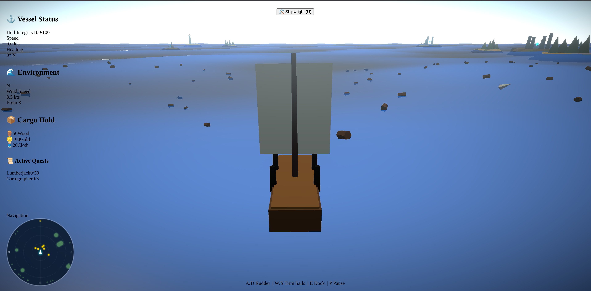

# ⚓ Sailing Adventure 3D



A high-seas exploration, combat, and trading RPG built with **React**, **Three.js**, and **TypeScript**. Navigate a procedurally generated ocean, engage in naval combat, trade with merchant fleets, and discover hidden treasures in a dynamic, living world.

---

## 🚀 Features

### 🌊 Advanced Simulation
*   **Dynamic Ocean:** Realistic water simulation using custom GLSL shaders with buoyancy physics.
*   **Weather System:** Procedural weather cycles (Rain, Fog, Clear skies) affecting visibility and ship handling.
*   **Day/Night Cycle:** Celestial system with dynamic lighting and skybox transitions.
*   **Wind Dynamics:** Realistic wind simulation that impacts sailing speed and maneuverability.

### ⚔️ Naval Gameplay
*   **Ship Combat:** Broadside cannon fire, projectile physics, and visual damage effects.
*   **Enemy AI:** Hostile fleets with tactical positioning and engagement logic.
*   **Abilities:** Captain skills and ship upgrades to turn the tide of battle.

### 🗺️ Exploration & Economy
*   **Infinite World:** Chunk-based world generation for seamless exploration of islands and open seas.
*   **Trading:** Buy and sell goods with merchant fleets and island outposts.
*   **Quests & Discoveries:** Treasure maps, salvageable wreckage, and procedural quest lines.
*   **Fishing:** Interactive fishing minigame to gather resources.

### 🛠️ Progression
*   **Shipyard:** Upgrade your ship's hull, sails, cannons, and crew capacity.
*   **Crew Management:** Recruit and manage a crew to improve ship performance.

---

## 🛠️ Tech Stack

*   **Framework:** [React 18](https://reactjs.org/)
*   **3D Engine:** [Three.js](https://threejs.org/) via [@react-three/fiber](https://github.com/pmndrs/react-three-fiber)
*   **Component Library:** [@react-three/drei](https://github.com/pmndrs/drei)
*   **State Management:** [Zustand](https://github.com/pmndrs/zustand)
*   **Styling:** [Tailwind CSS](https://tailwindcss.com/)
*   **Build Tool:** [Vite](https://vitejs.dev/)
*   **Language:** [TypeScript](https://www.typescriptlang.org/)
*   **Physics:** Custom-built Buoyancy, Wind, and Projectile systems.

---

## 📂 Project Structure

```text
src/
├── components/          # React Three Fiber components (3D entities)
│   ├── effects/         # VFX: Particles, Wake, Post-processing, Combat VFX
│   ├── environment/     # World entities: Islands, Weather, Wildlife, Fleets
│   ├── ocean/           # Ocean mesh and simulation logic
│   └── ship/            # Ship visuals, controller, and camera systems
├── core/                # Pure TypeScript logic (Engine & Systems)
│   ├── audio/           # AudioManager and sound triggers
│   ├── engine/          # Game loop, Scene management, Engine bridge
│   ├── physics/         # Buoyancy, Wind, Ship, and Projectile physics
│   ├── shaders/         # Custom GLSL shaders (Ocean, Sky)
│   └── systems/         # Game mechanics (AI, Weather, Quests, Trade)
├── stores/              # Zustand stores for global reactive state
├── ui/                  # React/Tailwind UI (HUD, Menus, Panels)
└── utils/               # Math helpers, Asset loaders, Procedural tools
```

---

## 🏗️ Architecture

The project follows a **Hybrid Reactive Architecture**:

1.  **The Core (Pure TS):** High-performance game logic (physics, AI, systems) runs outside of React's render cycle to ensure stable frame rates.
2.  **The Bridge (`EngineBridge`):** Synchronizes the pure TS state with React's component lifecycle and stores.
3.  **The View (R3F):** React components declaratively describe the 3D scene, responding to state changes in the stores.
4.  **The UI (Tailwind):** A lightweight overlay that provides telemetry and interaction menus.

---

## 🚦 Getting Started

### Prerequisites
*   Node.js (>= 20.0.0)
*   npm (>= 10.0.0)

### Installation
```bash
# Clone the repository
git clone <repository-url>

# Install dependencies
npm install
```

### Development
```bash
# Start dev server
npm run dev
```

### Build
```bash
# Compile and bundle for production
npm run build
```

---

## 🎮 Controls

| Key | Action |
| :--- | :--- |
| **W / S** | Adjust Sail (Accelerate / Decelerate) |
| **A / D** | Steer Left / Right |
| **Space** | Fire Cannons |
| **E** | Interact (Dock / Salvage / Talk) |
| **U** | Open Upgrade Shop |
| **P** | Pause Game |
| **ESC** | Close Menus |

---

## 📄 License

This project is licensed under the MIT License - see the LICENSE file for details.
